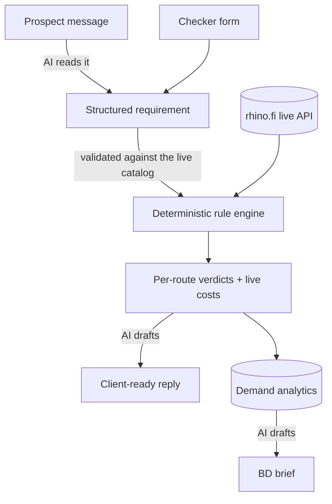

# Route Desk

A live route-feasibility checker for [rhino.fi](https://rhino.fi). Describe where funds come from, what they should become on arrival, and any commercial requirements, and get a per-route verdict computed from rhino.fi's live API, the current costs, and a hand-off ready to send to the team.

Every answer is derived from live data. There is no hand-typed support table, and the tool never fabricates a "yes."

> Unofficial. Not affiliated with rhino.fi. Route and token data belongs to rhino.fi.

## Why it exists

A BD or sales conversation often stalls on one question: can rhino route this exact thing? The honest answer changes with rhino's live config, and a wrong "yes" is worse than a slow "no." Route Desk answers it in one place, from live data, and says plainly where it cannot.

## What's in it

Three surfaces in one warm, editorial style.

**Checker (`/`).** Pick deposit chains and tokens, a settlement target, an arrival form, and three commercial toggles. Get a grid of verdicts (clear, needs an extension, not supported), the live cost per route, and the extensions the request would require.

**BD workspace (`/workspace`).** Paste what a prospect said in plain English. A model reads it into a structured requirement, the checker runs the verdicts, and a reply is drafted from the verified result. The model handles the language; the engine and live data decide feasibility.

**Demand insights (`/insights`).** Every check is captured. The dashboard ranks what prospects ask for that rhino cannot serve yet (the strongest build signals), what is gated behind a paid extension, and where the volume sits. A one-click AI brief turns it into prose for a standup or a planning doc.

## The one rule: never a false yes

Feasibility is decided by deterministic code against rhino.fi's live API, never by a model and never by a cached table.

- The catalog of chains, tokens, and Smart Deposit Address support is fetched from rhino's own config on each check.
- A chain that cannot mint a Smart Deposit Address, or a token missing from the live support list, is reported as blocked with the reason, not glossed over.
- In the AI workspace the model only reads language into a requirement and drafts prose. Its extraction is intersected with the live catalog, so a chain or token it invents is dropped and flagged rather than fed into the check.

## Architecture



The browser only ever talks to the app's own `/api` routes; the server calls rhino.fi. Config and swap lists are cached briefly, quotes are fetched fresh. The rule engine and the analytics aggregation are pure functions with unit tests.

## Getting started

### Prerequisites

- Node 22 or newer

### Run it

```bash
npm install
npm run dev
```

Open http://localhost:3000. The checker and insights work immediately against the live rhino.fi API.

### Configuration

Everything is optional. Copy `.env.example` to `.env.local` to change defaults.

`RHINO_API_BASE` sets the rhino.fi API base and defaults to `https://api.rhino.fi`.

The AI workspace and the demand brief need a model provider. Pick one.

Anthropic (Claude), the default:

```bash
AI_PROVIDER=anthropic
ANTHROPIC_API_KEY=sk-ant-...
ANTHROPIC_MODEL=claude-opus-5     # optional
```

Any OpenAI-compatible endpoint (an NVIDIA NIM on build.nvidia.com, a self-hosted NIM, OpenRouter, and so on):

```bash
AI_PROVIDER=nvidia
AI_API_KEY=nvapi-...
AI_BASE_URL=https://integrate.api.nvidia.com/v1          # optional
AI_MODEL=nvidia/nemotron-3.5-lightning-30b-a3b           # optional
```

With no provider key set, the checker and insights are unaffected; the AI features report themselves unconfigured until a key is present.

## Scripts

| Command | What it does |
| --- | --- |
| `npm run dev` | Dev server (Turbopack) |
| `npm run build` | Production build |
| `npm start` | Serve the production build |
| `npm test` | Unit tests (rule engine and analytics) |
| `npm run lint` | eslint |

## Stack

Next.js 16 (App Router, Turbopack), React 19, TypeScript, Tailwind CSS v4. The Claude provider uses the Anthropic SDK; any other provider is reached over its OpenAI-compatible HTTP API.

## Notes for a real deployment

- `/workspace` and `/insights` are internal. Put them behind auth before exposing the app publicly.
- The demand store is a local JSON-lines file, which is fine for a single node. For a serverless deploy, swap the two functions in `src/lib/analytics/store.ts` for a durable store such as Postgres, a KV, or a product-analytics pipeline.
